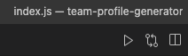
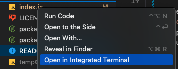

# Bootcamp Module 12 Challenge: Team Profile Generator

## Description

This project is a [Node.js](https://nodejs.org/en/docs/) command-line application that dynamically generates an HTML page from user collected input. User input is collected via prompts generated using the [Inquirer.js](https://github.com/SBoudrias/Inquirer.js#readme) package. Prompts rely on Class constructors, which are validated through [Jest](https://jestjs.io/docs/getting-started) tests.

For the purpose of this challenge, user input is being used to dynamically generate a team profile. A Team is composed of a Manager, an Engineer, and an Intern (at the very least). These roles are Classes, and they extend the parent Class of Employee - there are properties and methods to each Class (some shared, some role specific).

## Table of Contents

- [Installation](#installation)
- [Usage](#usage)
- [Tests](#tests)
- [Badges](#badges)
- [License](#license)

## [Installation](#installation)

Since this is a [Node.js](https://nodejs.org/en/docs/) command-line application, this needs to be installed in order to be able to run the project. See download/installation options [here](https://nodejs.org/en/download/).

This project also relies on 2 [npm](https://docs.npmjs.com/) packages ([Inquirer.js](https://www.npmjs.com/package/inquirer) and [Jest](https://www.npmjs.com/package/jest)), therefore users should: 1) be able to install npm packages. 2) run `npm i` to install the necessary dependencies.

## [Usage](#usage)

If you have [Code Runner](https://marketplace.visualstudio.com/items?itemName=formulahendry.code-runner) installed and configured, first click on `index.js` and then on the "Run Code" button on the top right corner:

This will trigger the application to run in your terminal.

Should you want to run the application from the terminal yourself, locate and right-click `index.js` and select the "Open in Integrated Terminal" option:

Type `node index.js` and hit "Enter" to trigger the application to run.

## [Tests](#tests)

This application contains validation tests. These can be more closely examined on the [`__tests__`](./__tests__/) folder. Should you wish to run the tests\*, you can:

- Run `npm run test` to run all tests.
- If you want to isolate one block of tests, consider this example: `npm run test Employee.test.js`. This will only run the Employee related tests.

\* _Ensure you have installed the relevant project dependencies, otherwise you might be confronted with an error message._

## [Badges](#badges)

### Languages

- 
- 
- 

### Dependencies

- 
- 

## [License](#license)

- 
